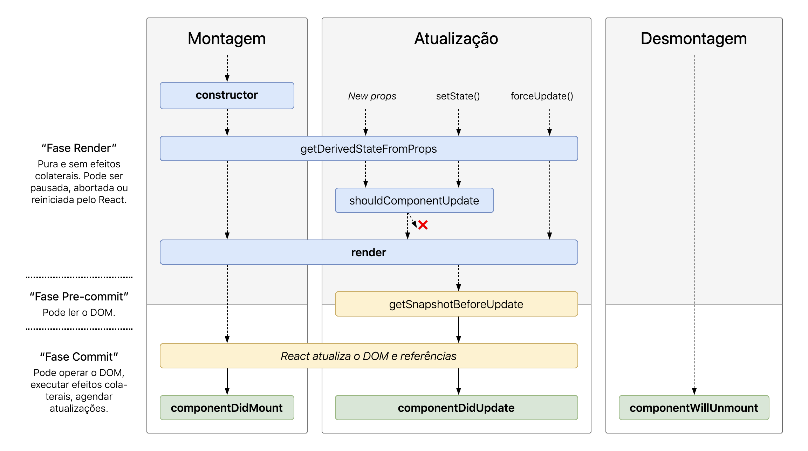

# React II

Este módulo tem como objetivo ensinar às alunas conceitos para a criação de um pequeno projeto SPA (single page application) utilizando React.


***

* [Revisão](#revisão)
* [Iniciando o projeto](#iniciando-o-projeto)
* [Packages](#packages)
  - [O que é NPM](#o-que-é-npm)
  - [package.json](#package.json)
  - [package.json x package.lock.json](#package.json-x-package.lock.json)
  - [Exemplos de packages](#exemplos-de-packages)
* [Rotas](#rotas)
  - [O que é SPA](#o-que-é-spa)
  - [Usando react-router-dom](#usando-react-router-dom)
* [Formulário](#formulário)
  - [Componentes controlados](#componentes-controlados)
  - [Utilizando reducers ao registrar eventos](#utilizando-reducers-ao-registrar-eventos)
* [Requisições API](#requisições-api)
  - [O que é o Axios](#o-que-é-axios)
  - [Ciclo de vida do componente](#ciclo-de-vida-do-componente)
  - [Utilizando array como children](#utilizando-array-como-children)
* [Exercício](https://github.com/reprograma/T8-React-II/blob/master/src/exercicio.md)

***

## Revisão
  - O que é React?
  - JSX & Babel
  - Props x State
  - Renderizações condicionais
  - Create-react-app
  - Arquitetura do projeto
  - Boas práticas

O link da apresentação da revisão encontra-se [aqui](https://docs.google.com/presentation/d/1RIgwY2Rh6eK-ozRGBL1bv4MKRKSWjO0hrVxwtDhxBYU/edit?usp=sharing)

***

## Iniciando o projeto
O projeto que vamos desenvolver nessa semana se chama **RocketChat**, semelhante ao [Rocket.Chat](https://rocket.chat)! Então digamos que você acabou de entrar para equipe e você fará parte do desevolvimento do novo projeto deles rs

  - Criar um repositório com o nome `RocketChat - Aula React II`
  - Usar o `create-react-app` para criar o boilerplat do projeto
  - Acesse https://rocketchat.netlify.com/ para ver o projeto que iremos desenvolver
  - Acesse https://drive.google.com/open?id=1okZ0CyFfk6ghcAm6KhxD0uxvTjXZsl-V para pegar as imagens do projeto
  - Acesse os links abaixo para pegar o css
    - [Pagina de Contato](https://github.com/reprograma/T8-React-II/blob/master/src/paginas/Contato/styles.css)
    - [Pagina de Chat](https://github.com/reprograma/T8-React-II/blob/master/src/paginas/Chat/styles.css)
    - [Componente Header](https://github.com/reprograma/T8-React-II/blob/master/src/componentes/Header/styles.css)
    - [Componente Mensagens](https://github.com/reprograma/T8-React-II/blob/master/src/componentes/Mensagens/styles.css)
    - [Componente Nav](https://github.com/reprograma/T8-React-II/blob/master/src/componentes/Nav/styles.css)
    - [Componente Menu](https://github.com/reprograma/T8-React-II/blob/master/src/componentes/Nav/Menu/styles.css)

***

## Packages

#### O que é NPM
NPM é muitas coisas:

  * npm é o gerenciador de pacotes do Node.js. Foi criado em 2009 como um projeto de código aberto para ajudar os desenvolvedores de JavaScript a compartilhar facilmente módulos de código empacotados.
  * O npm Registry é uma coleção pública de pacotes de código-fonte aberto para Node.js., aplicativos Web front-end, aplicativos móveis, robôs, roteadores e inúmeras outras necessidades da comunidade JavaScript.
  * O npm é o cliente da linha de comando que permite aos desenvolvedores instalar e publicar esses pacotes.
  * A npm, Inc. é a empresa que hospeda e mantém todos os itens acima.

Fonte: [npmjs](https://www.npmjs.com/about)

#### package.json
Quando você instala um pacote com o NPM, uma nova entrada é adicionada ao arquivo package.json contendo o nome do pacote e a versão que será usada. O real benefício de ter dependências definidas no package.json é que qualquer um pode ter acesso a esse arquivo e criar um pasta de dependências contendo todos os módulos para rodar sua aplicação.

Exemplo do nosso package.json:

```json
{
  "name": "projeto",
  "version": "0.1.0",
  "private": true,
  "dependencies": {
    "axios": "^0.19.0",
    "classnames": "^2.2.6",
    "json-server": "^0.15.1",
    "react": "^16.11.0",
    "react-dom": "^16.11.0",
    "react-router-dom": "^4.3.1",
    "react-scripts": "2.1.1"
  },
  "scripts": {
    "start": "react-scripts start",
    "build": "react-scripts build",
    "test": "react-scripts test",
    "eject": "react-scripts eject"
  },
  "eslintConfig": {
    "extends": "react-app"
  },
  "browserslist": [
    ">0.2%",
    "not dead",
    "not ie <= 11",
    "not op_mini all"
  ]
}
```

Onde temos:

  - *name* define o nome da aplicação ou pacote;
  - *version* indica a versão atual;
  - *private* (true) previne a sua aplicação de ser publicada acidentalmente no npm;
  - *scripts* define um conjunto de scripts Node para você executar;
  - *dependencies* define uma lista de pacotes npm instalados como dependências. Você ainda pode ter *devDependencies*, ou seja, uma lista de pacotes npm instalados como dependências de desenvolvimento;
  - *eslintConfig* especifica regras de lint do projeto;
  - *browserslist* é usado para dizer quais browsers (e versões) você quer suportar;

#### package.json x package.lock.json
O objetivo do **package.lock.json** é manter registro das versões exatas de cada pacote que é instalado para que um produto possa ser 100% reproduzível da mesma maneira mesmo se os pacotes forem atualizados por seus mantenedores.

Isto soluciona um problema bem específico que o **package.json** não resolvia. No **package.json** você pode definir quais versões você quer atualizar, usando a notação semver, por exemplo:

se você escrever ~0.13.0, você quer somente atualizar patch releases: 0.13.1 está ok, mas 0.14.0 não.
se você escrever ^0.13.0, você quer atualizar patches e minor releases: 0.13.1, 0.14.0 e assim por diante.
se você escrevere 0.13.0, você somente usará esta versão exata do pacote.

Você não commita no Git a sua pasta `/node_modules`, uma vez que ela é geralmente muito grande, e quando você tenta replicar o projeto em outra máquina usando o comando `npm install`, se você especificar a sintaxe ~ e uma patch release de um pacote tiver sido lançada, ela será instalada. O mesmo para  ^ e minor releases.

Se você especificar as versões exatas, como 0.13.0 neste exemplo, você não sofre desse problema.

Além poder ser um problema para você, pode ser um problema para outra pessoa qualquer querendo rodar o seu projeto com `npm install`, podendo acontecer do seu projeto original ficar diferente da nova instalação. Isto implica obviamente em possíveis bugs, mesmo que seja um patch ou minor release.

O arquivo **package-lock.json** define as versões instaladas de cada pacote de maneira irreversível e o npm usará exatamente estas versões quando você rodar `npm install`.

Fonte: [Guia completo do package.json](https://www.luiztools.com.br/post/o-guia-completo-do-package-json-do-node-js/)

#### Exemplos de packages

Em nosso projeto nós iremos utilizar algumas da lista abaixo, mas existem milhares de opções!

  * [Create React App](https://github.com/facebook/create-react-app)
  * [React-Router-Dom](https://reacttraining.com/react-router/web/guides/quick-start)
  * [Axios](https://www.npmjs.com/package/axios)
  * [Redux](https://redux.js.org/)
  * [Bootstrap](https://www.npmjs.com/package/react-bootstrap)
  * [Material UI](https://www.npmjs.com/package/@material-ui/core)
  * [Ant Design](https://ant.design/docs/react/introduce)
  * [Styled Components](https://github.com/styled-components/styled-components)
  * [Formik](https://github.com/jaredpalmer/formik)
  * [Jest](https://jestjs.io/)
  * [Gatsby](https://www.gatsbyjs.org/)

***

## Rotas

### O que é SPA
Um aplicativo de página única (em inglês “single-page application”, ou SPA) é uma aplicação web ou site que consiste de uma única página web com o objetivo de fornecer uma experiência do usuário similar à de um aplicativo desktop. Em um SPA, todo o código necessário (HTML, JavaScript e CSS) ou é obtido com um único carregamento de página, ou os recursos apropriados são carregados dinamicamente e adicionados à página conforme necessário, geralmente em resposta a ações do usuário. A página não é recarregada em qualquer momento do processo, tampouco ocorre a transferência de controle para outra página, embora a URL no navegador ou a API de história do HTML5 possam ser usadas para fornecer a percepção e navegabilidade de páginas separadas ao aplicativo.

#### SPA

**Prós:**
- Melhor experiência de usuário
- Performance (pode ser uma vantagem e uma desvantagem, depende de vários fatores)
- Responsabilidade maior para o front-end (possibilitando melhores otimizações e trabalho em cima da aplicação)

**Contras:**
- Curva de aprendizado pode ser meio complexa no início
- SEO não é tão simples de resolver como em uma aplicação convencional
- Performance pode ser um problema se mal otimizado

**Quem usa?**
Os exemplos para empresas que utilizam SPA’s são diversos:

  - *Netflix:* com exceção da página inicial e páginas externas, toda a aplicação da Netflix é feita utilizando React. O que faz total sentido, já que é um catálogo que fica depois de um login e senha e não precisa ser indexada no Google.
  - *Airbnb:* outro bom exemplo que utiliza também React. A aplicação da Airbnb é um pouco mais complexa que a da Netflix, pois algumas coisas eles precisam renderizar no servidor (por questão de SEO) e outras não.
  - *Twitter:* o Twitter para mim é uma incógnita, achei esse link no Quora, explicando um pouco sobre a stack front-end deles, minha opinião é que eles utilizam alguma técnicas semelhante a da Cotabox, Airbnb e tal, que mescla SPA com aplicações convencionais.
  - *Gmail/Google:* O Google possui uma das arquiteturas mais doidas, que também mescla tudo isso que eu já citei. Eles utilizando o framework próprio Closure na maior parte das aplicações deles. Também achei um link de uma talk com um desenvolvedor falando sobre desenvolvimento JavaScript gigantescas, iguais as dele.

Essas aplicações, não são totalmente SPA’s, mas incorporam muitos elementos de uma e fazem de certa maneira uma mescla:

  - *Youtube:* O Youtube é feito em Python, em uma estrutura MVC, porém o próprio Youtube criou um framework JavaScript chamado SPFJS, a ideia é a mesma utilizada na Cotabox, primeiro é renderizado o conteúdo do servidor, depois disso o JavaScript “hidrata” a tela, ou seja, quando navegar entre páginas, somente o que é mudado é solicitado ao servidor, que quando recebe o conteúdo, adiciona a tela da mesma maneira que um React/Vue.js/Angular fazem normalmente.
  - *Facebook:* Esse aqui já nem da pra perceber o que é, do que não é.
  - *Github:* O Github utiliza Ruby On Rails, e apenas utiliza JavaScript para melhorar a experiência do usuário.

#### Aplicações convencionais

**Prós:**
- Tempo de carregamento da página normalmente é menor
- SEO funciona bem desde sempre
- Existe até mesmo DÉCADAS de conhecimento sobre o assunto (variando de linguagem para linguagem e de framework para framework)

**Contras:**
- Muito fácil do projeto virar um monolito gigante que é muito difícil de dar manutenção, principalmente no front-end
- Não possibilita um domínio completo do front-end, normalmente o projeto é feito por desenvolvedores full-stack, e o foco é grande no back-end, o que prejudica um pouco a usabilidade

**Quem usa?**
Esse aqui foi até difícil de lembrar, são sites que utilizam pouco, ou quase nada de JavaScript:

  - *The New York Times*
  - *G1*
  - *BBC*
  - *Sites que utilizam Wordpress no geral*

Fonte: [Training Center](https://medium.com/trainingcenter/descomplicando-spas-caa8f57bdbf3)

### Usando react-router-dom
O `react-router-dom` é uma biblioteca de roteamento usada para criar paginação nas aplicações de `react`.

Para comerçar é necessário fazer a instalação do package:

```sh
npm install react-router-dom
```

A primeira configuração é adicionar o `BrowserRouter` ao `./index.js` que permitirá o uso da history API do HTML5 (os eventos de pushState, replaceState e popstate) para manter sua interface do usuário sincronizada com a URL.

```jsx
import { BrowserRouter as Router } from 'react-router-dom'

ReactDOM.render(
  <Router>
    <App />
  </Router>,
  document.getElementById('root')
)
```

Depois disso temos que realizar a configuração das rotas no arquivo `./App.js`

```jsx
import { Switch, Route } from 'react-router-dom'

function App () {
  return (
    <Switch>
      <div>
        <Route exact path='/' component={PaginaInicial} />
        <Route path='/contato' component={Contato} />
        <Route path='/chat' component={Chat} />
      </div>
    </Switch>
  )
}
```

Onde temos:

- *Switch*: Renderiza o primeiro filho `<Route>` ou `<Redirect>` que corresponde ao local. Como isso é diferente do que usar apenas um monte de `<Route>`s? O `<Switch>` é único, pois renderiza uma rota exclusivamente. Por outro lado, todo `<Route>` que corresponde ao local é renderizado inclusive. (comportamente semelhante ao **Switch Case do JS**)
- *Route*: é talvez o componente mais importante no React Router para entender e aprender a usar bem. Sua responsabilidade mais básica é renderizar alguma interface do usuário quando o caminho corresponder à URL atual.
- *path*: é uma string ou array de strings com qualquer caminho de URL válido. Pode-se utilizar regex.
- *component*: o componente da sua aplicação que deverá ser renderizado em um determinado *path*
- *exact*: quando verdadeiro, corresponderá apenas se o caminho corresponder exatamente ao location.pathname.

Depois disso podemos abrir nosso navegador e ver que as rotas deverão trazer os componentes que declaramos em nossos `<Route>`s

Para finalizar podemos enfim configurar nosso `./componentes/Nav/Menu` conforme abaixo:

```jsx
import { Link } from 'react-router-dom'
```

```jsx
<ul className={classesDasOpcoes}>
  <li>
    <Link to='/' className='navbar-links__ativo'>
      Home
    </Link>
  </li>
  <li>
    <Link to='/contato' className='navbar-links__ativo'>
      Contato
    </Link>
  </li>
  <li>
    <Link to='/chat' className='navbar-links__ativo'>
      Chat
    </Link>
  </li>
</ul>
```

Onde temos:

- *Link*: fornece navegação declarativa e acessível em torno de seu aplicativo.
- *to*: pode ser uma string, objeto ou função. Acima usamos uma representação de string do local do Link. Ela pode ser criada concatenando as propriedades **Location Pathname**, **Search** e **Hash**.

Exemplo:

```jsx
<Link to="/courses?sort=name" />
```

Fonte: [React Router](https://reacttraining.com/react-router/web/guides/quick-start)

***

## Formulários
Os elementos de formulário HTML funcionam de maneira um pouco diferente de outros elementos DOM no React, porque os elementos de formulário mantêm naturalmente algum estado interno. Por exemplo, este formulário em HTML puro aceita um único nome:

```html
<form>
  <label>
    Nome:
    <input type="text" name="name" />
  </label>
  <input type="submit" value="Enviar" />
</form>
```

### Componentes controlados
Em HTML, elementos de formulário como `<input>`, `<textarea>` e `<select>` normalmente mantêm seu próprio estado e o atualiza baseado na entrada do usuário. Em React, o estado mutável é normalmente mantido na propriedade state dos componentes e atualizado apenas com `setState()`.

Podemos combinar os dois fazendo o estado React ser a “única fonte da verdade”. Assim, o componente React que renderiza um formulário também controla o que acontece nesse formulário nas entradas subsequentes do usuário. Um input cujo o valor é controlado pelo React dessa maneira é chamado de “componente controlado” (controlled component).

Por exemplo, se quisermos que o exemplo anterior registre o nome quando ele for enviado, podemos escrever o formulário como um componente controlado:

```jsx
class NameForm extends React.Component {
  constructor(props) {
    super(props);
    this.state = {value: ''};

    this.handleChange = this.handleChange.bind(this);
    this.handleSubmit = this.handleSubmit.bind(this);
  }

  handleChange(event) {
    this.setState({value: event.target.value});
  }

  handleSubmit(event) {
    alert('Um nome foi enviado: ' + this.state.value);
    event.preventDefault();
  }

  render() {
    return (
      <form onSubmit={this.handleSubmit}>
        <label>
          Nome:
          <input type="text" value={this.state.value} onChange={this.handleChange} />
        </label>
        <input type="submit" value="Enviar" />
      </form>
    );
  }
}
```

Como o atributo value é definido no nosso `<input type="text">`, o valor exibido sempre será o mesmo de this.state.value, fazendo com que o estado do React seja a fonte da verdade. Como o handleChange é executado a cada tecla pressionada para atualizar o estado do React, o valor exibido será atualizado conforme o usuário digita.

Com um componente controlado, cada mutação de estado terá uma função de manipulação (handler function) associada. Isso faz com que seja simples modificar ou validar a entrada do usuário. Por exemplo, se quiséssemos impor que os nomes sejam escritos com todas as letras maiúsculas, poderíamos escrever handleChange como:

```jsx
handleChange(event) {
  this.setState({value: event.target.value.toUpperCase()});
}
```

Fonte: [reactjs](https://pt-br.reactjs.org/docs/forms.html)

#### Utilizando reducers ao registrar eventos
Ao manipularmos eventos, é comum adotar a convenção de nomeação `handle{NomeDoEvento}`.

```jsx
handleClick (e) {
  /* faz algo */
}
```

Para componentes que manipulam vários tipos de eventos, esses nomes de funções podem ser repetitivos. Os próprios nomes podem não fornecer muito valor, pois eles simplesmente são delegam a lógica para outras ações/funções.

```jsx
handleClick () {
  (/* faz algo */)
}

handleMouseEnter () {
  this.setState({ hovered: true })
}

handleMouseLeave () {
  this.setState({ hovered: false })
}
```

Um padrão comum é um único manipulador de eventos para o seu componente e identificar as ações a partir do event.type.

```jsx
handleEvent({type}) {
  switch(type) {
    case "click":
      return (/* faz algo */)
    case "mouseenter":
      return this.setState({ hovered: true })
    case "mouseleave":
      return this.setState({ hovered: false })
    default:
      return console.warn(`Nenhuma ação para "${type}"`)
  }
}
```

Você pode mover esse switch fora do componente, deixando testes ainda mais simples.

Fonte: [Padrões em react](https://medium.com/@oieduardorabelo/padr%C3%B5es-em-react-criando-componentes-d35422034d75)
***

## Requisões API

### O que é Axios
Axios é um cliente HTTP, que funciona tanto no browser quanto em node.js. A biblioteca é basicamente uma API que sabe interagir tanto com `XMLHttpRequest` quanto com a interface `http` do node. Isso significa que o mesmo código utilizado para fazer requisições ajax no browser também funciona no servidor. Além disso, as requisições feitas através da biblioteca retornam uma promise, compatível com a nova versão do JavaScript - ES6.

>NOTA: async / await faz parte do ECMAScript 2017 e não é suportado no Internet Explorer e em navegadores mais antigos, portanto, use com cuidado.

Para comerçar é necessário fazer a instalação do package:

```sh
npm install axios
```

Depois de instalar, utilizar a biblioteca é bastante simples. Além de `post` e `get`, existem os métodos `delete`, `head`, `put` e `patch`, que fazem requisições com o tipo equivalente em `HTTP`.

Os método `put` e `patch` são similares ao `post`, e exigem um parâmetro extra contendo os dados que serão enviados.


Em nosso caso, vamos criar nossa requisição na pasta `./service/base.js` onde criaremos uma variavel `config` e nosso `protocolo`. Depois vamos criar nossa função de `getMensagens()` essa deve ser exportada para ser usada no componente que fará a requisição das mensagens.

```jsx
import axios from 'axios'

const config = {
  baseURL: 'https://my-json-server.typicode.com',
  timeout: 1000
}

const protocolo = axios.create(config)

export function getMensagens () {
  const url = '/reprograma/T8-React-II/mensagens'
  return protocolo.get(url)
}
```

Onde temos:

  - *url*: é o `URL` do servidor que será usado para a solicitação.
  - *baseURL*: será anexado ao `url`, a menos que o `url` seja absoluto. Pode ser conveniente definir `baseURL` para que uma instância de axios transmita `URL`s relativas para métodos dessa instância.
  - *timeout*:  especifica o número de milissegundos antes do tempo limite da solicitação. Se a solicitação demorar mais que `timeout`, ela será abortada. O valor padrão do `timeout` é 0.

Existem outras opções para fazer requisições como `headers`, `params`, `auth`, `data`, `method`, `proxy` e etc.

Fonte: [axios](https://github.com/axios/axios)

***

### Ciclo de vida do componente



Cada componente possui muitos “métodos do ciclo de vida” que você pode sobrescrever para executar determinado código em momentos particulares do processo. Você pode usar o diagrama acima do ciclo de vida para consulta. Na lista abaixo, os métodos do ciclo de vida mais usados estão marcados em negrito. O resto deles, existe para o uso em casos relativamente raros.

#### Montando (mounting)
Estes métodos são chamados na seguinte ordem quando uma instância de um componente está sendo criada e inserida no DOM:

* **constructor()**
* static getDerivedStateFromProps()
* **render()**
* **componentDidMount()**

#### Atualizando
Uma atualização pode ser causada por alterações em props ou no state. Estes métodos são chamados na seguinte ordem quando um componente esta sendo re-renderizado:

- static getDerivedStateFromProps()
- shouldComponentUpdate()
- **render()**
- getSnapshotBeforeUpdate()
- **componentDidUpdate()**

#### Desmontando (unmounting)
Estes métodos são chamados quando um componente está sendo removido do DOM:

- **componentWillUnmount()**

Fonte: [reactjs](https://pt-br.reactjs.org/docs/react-component.html)

#### Utilizando array como children
Fornecer uma array como children é muito comum. Podemos usar `map()` para renderizar um array de elementos React.

```jsx
<ul>
  {["first", "second"].map((item) => (
    // Não se esqueça, `key` deve ser única
    <li key={item}>{item}</li>
  ))}
</ul>
```

É equivalente ao:

```jsx
<ul>
  {[
    <li key="first">first</li>,
    <li key="second">second</li>,
  ]}
</ul>
```

Esse padrão pode ser combinado com a desestruturação de atributos JSX e outros componentes:

```jsx
<ul>
  {arrayOfMessageObjects.map(({ id, ...message }) =>
    <Message key={id} {...message} />
  )}
</ul>
```

E a partir do React 16, podemos renderizar um array de componentes:

```jsx
render() {
  // Sem a necessidade de um elemento extra
  return [
    // Não se esqueça das `keys` :)
    <li key="A">First item</li>,
    <li key="B">Second item</li>,
    <li key="C">Third item</li>,
  ];
}
```

Fonte: [Padrões em react](https://medium.com/@oieduardorabelo/padr%C3%B5es-em-react-criando-componentes-d35422034d75)
